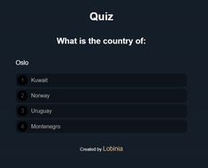

    

## Description

This is a Quiz made in JavaScript.

The user mark the answer he thinks is the correct and the score is displayed at the end.

The correct answers are, in order.
2, 3, 4, 2, 4, 4, 1, 2, 3, 1, 1